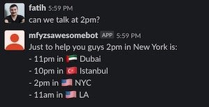

# Slack Timezone Bot

A simple slack bot translates time posted in a channel in multiple timezones.




## Configure & run

Create a new slack app, then enable slack bot feature in the app, then install to your workspace, obtain slack access and bot token and place it in .env file:

```
SLACK_ACCESS_TOKEN='...'
SLACK_BOT_TOKEN='...'
```

Good to go, run:

```
npm start
```